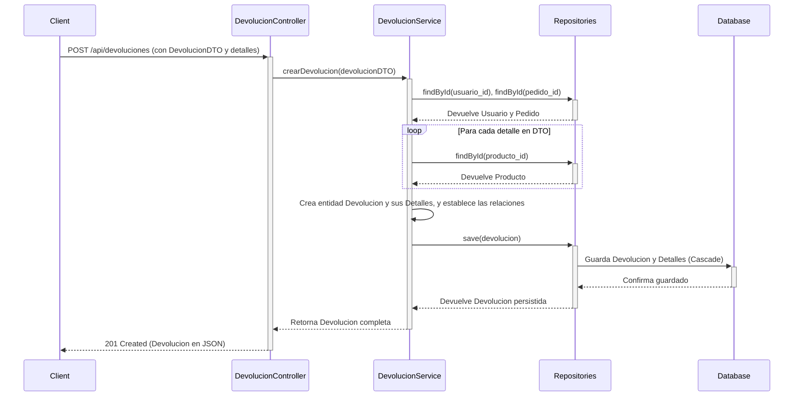
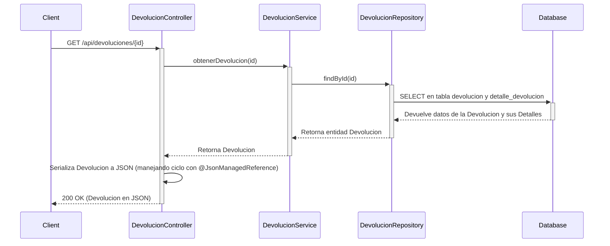
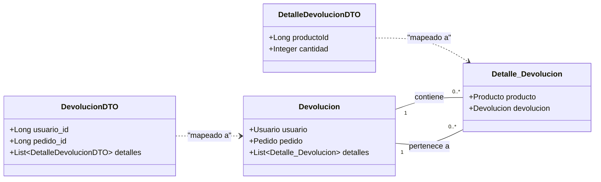

# Lógica de Negocio y Flujo de Devoluciones

Este documento explica la lógica de negocio implementada para gestionar las devoluciones, desde la solicitud del cliente hasta la respuesta de la API. Se incluyen diagramas para visualizar los flujos principales.

---

## 1. Flujo de Creación de Devolución

Este flujo se activa cuando un cliente quiere registrar una nueva devolución, incluyendo los productos específicos que devuelve.

**Endpoint:** `POST /api/devoluciones`

### Lógica de Negocio:

1.  **Recepción de Datos**: El `DevolucionController` recibe una solicitud `POST` con un `DevolucionDTO` en el cuerpo. Este DTO contiene la información de la devolución y una lista de los detalles (`DetalleDevolucionDTO`).
2.  **Llamada al Servicio**: El controlador pasa el DTO al `DevolucionService` para procesar la lógica de negocio.
3.  **Creación de la Devolución**:
    *   El servicio crea una nueva entidad `Devolucion`.
    *   Busca en la base de datos el `Usuario` y el `Pedido` asociados usando los IDs del DTO.
    *   Itera sobre la lista de `DetalleDevolucionDTO`. Por cada uno:
        *   Crea una nueva entidad `Detalle_Devolucion`.
        *   Busca el `Producto` correspondiente.
        *   Establece la relación bidireccional: añade el detalle a la lista de la devolución y asigna la devolución al detalle.
4.  **Persistencia**: El servicio guarda la entidad `Devolucion` en la base de datos. Gracias a la configuración `CascadeType.ALL`, todos los detalles asociados se guardan automáticamente en la misma transacción.
5.  **Respuesta**: El controlador recibe la entidad `Devolucion` guardada (con todos sus detalles y un ID asignado), la serializa a JSON y la devuelve al cliente con un estado `201 Created`.

### Diagrama de Secuencia:

---

## 2. Flujo de Obtención de Devolución

Este flujo se activa para consultar el estado y los detalles de una devolución existente.

**Endpoint:** `GET /api/devoluciones/{id}`

### Lógica de Negocio:

1.  **Recepción de Solicitud**: El `DevolucionController` recibe una solicitud `GET` con el ID de la devolución.
2.  **Llamada al Servicio**: El controlador solicita al `DevolucionService` que obtenga la devolución.
3.  **Búsqueda en Base de Datos**: El servicio utiliza el `DevolucionRepository` para buscar la devolución por su ID.
4.  **Serialización JSON**:
    *   La entidad `Devolucion` recuperada contiene una lista de `Detalle_Devolucion`.
    *   Al serializar la respuesta, Jackson encuentra la anotación `@JsonManagedReference` en la lista de detalles de `Devolucion` y la incluye.
    *   Cuando procesa cada `Detalle_Devolucion`, encuentra la anotación `@JsonBackReference` en el campo `devolucion`, lo que evita que se serialize de nuevo la devolución, rompiendo el ciclo infinito.
5.  **Respuesta**: El controlador devuelve la entidad `Devolucion` serializada en formato JSON con un estado `200 OK`.

### Diagrama de Secuencia:

---

## 3. Estructuras de Datos (DTO vs. Entidad)

Se utilizan DTOs (Data Transfer Objects) para separar la representación de los datos en la API de la estructura de las entidades de la base de datos.

*   **Entidades (`@Entity`)**: Representan las tablas de la base de datos. Contienen la lógica de persistencia y las relaciones completas (ej: `Devolucion` tiene un objeto `Usuario` completo).
*   **DTOs**: Son clases simples que definen la estructura de los datos que se envían o reciben a través de la API. Son ideales para evitar exponer la estructura interna de la base de datos y para prevenir problemas de serialización (ej: `DevolucionDTO` solo necesita `usuario_id`, no el objeto `Usuario` entero).

### Diagrama de Clases (Simplificado):

