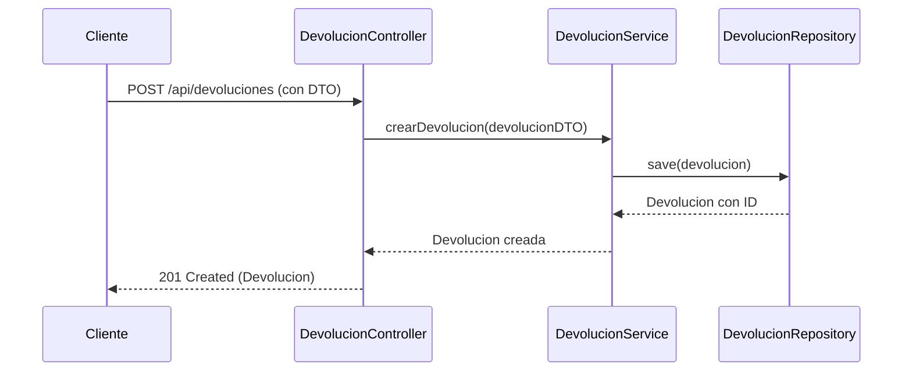
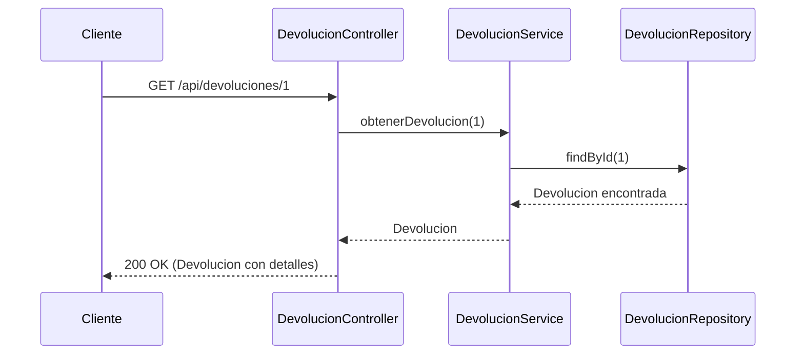
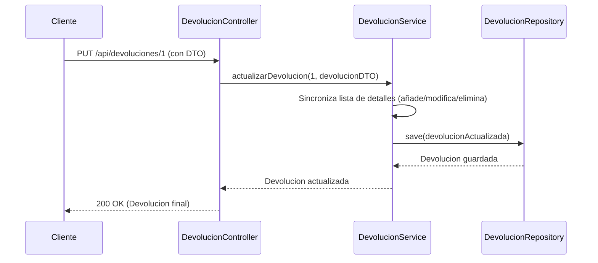
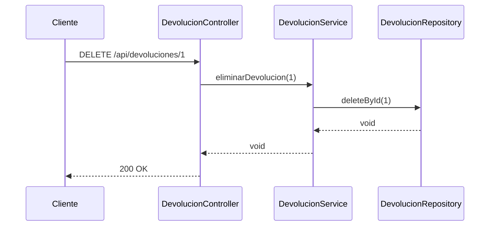
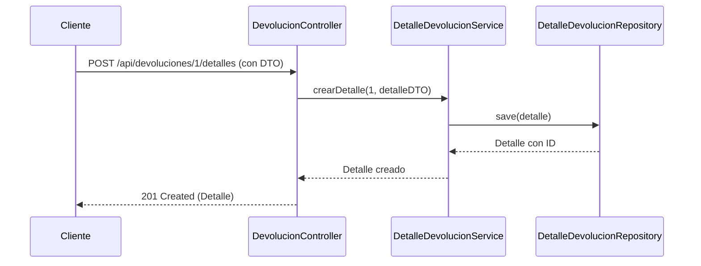
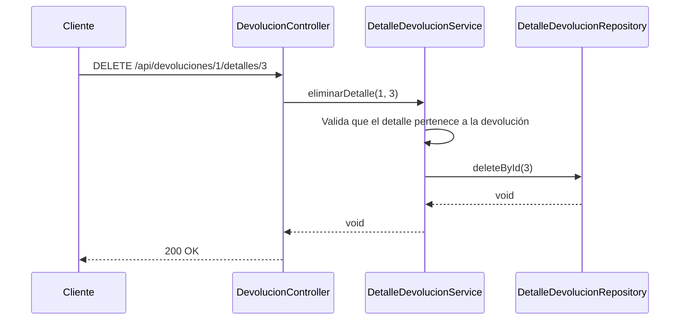
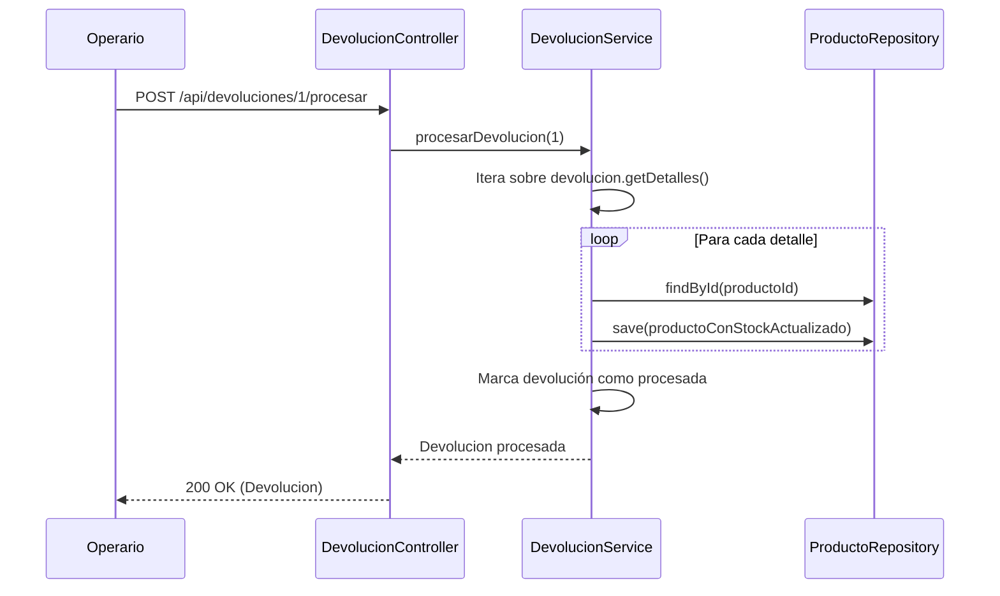

# Documentación Definitiva del Módulo de Devoluciones

Este documento es la guía completa para el módulo de devoluciones. Detalla la arquitectura final, la lógica de negocio, y el uso de cada endpoint de la API, utilizando el contexto de una carpintería para una comprensión clara y práctica.

---

## 1. Contexto de Negocio: Carpintería "El Buen Mueble"

"El Buen Mueble" vende muebles online. Un cliente puede realizar un pedido con múltiples artículos. El módulo de devoluciones gestiona el proceso cuando un cliente necesita devolver uno o más productos de su pedido.

- **Devolución**: Es el proceso general que agrupa los artículos devueltos de un mismo pedido.
- **Detalle de Devolución**: Es cada artículo específico que se devuelve dentro de ese proceso.

El diseño de la API busca centralizar y simplificar esta gestión.

---

## 2. Arquitectura Final de la API

La lógica se ha unificado en un único **`DevolucionController`**, que gestiona tanto las devoluciones como sus detalles. Los detalles se tratan como un **sub-recurso** de una devolución, siguiendo las mejores prácticas RESTful. Esto resulta en una API más limpia, predecible y fácil de mantener.

### Tabla de Endpoints Final

| Verbo   | Ruta                                                  | Descripción                                                              |
|---------|-------------------------------------------------------|--------------------------------------------------------------------------|
| `POST`  | `/api/devoluciones`                                   | Crea una nueva devolución completa con sus detalles.                     |
| `GET`   | `/api/devoluciones`                                   | Obtiene una lista de todas las devoluciones.                             |
| `GET`   | `/api/devoluciones/{id}`                              | Obtiene una devolución específica por su ID, incluyendo todos sus detalles. |
| `PUT`   | `/api/devoluciones/{id}`                              | Actualiza una devolución y sincroniza sus detalles (añade, modifica, elimina). |
| `DELETE`| `/api/devoluciones/{id}`                              | Elimina una devolución completa y todos sus detalles asociados.          |
| `POST`  | `/api/devoluciones/{devolucionId}/detalles`           | Añade un nuevo detalle a una devolución ya existente.                    |
| `DELETE`| `/api/devoluciones/{devolucionId}/detalles/{detalleId}` | Elimina un detalle específico de una devolución.                         |
| `GET`   | `/api/devoluciones/usuario/{usuarioId}`               | Busca todas las devoluciones iniciadas por un usuario específico.        |
| `GET`   | `/api/devoluciones/pedido/{pedidoId}`                 | Busca todas las devoluciones asociadas a un pedido específico.           |
| `POST`  | `/api/devoluciones/{id}/procesar`                     | Marca una devolución como procesada y repone el stock de los productos.  |

---

## 3. Flujos de Operaciones y Diagramas

A continuación, se detalla cada endpoint con su contexto, ejemplos y un diagrama de secuencia.

### 3.1. `POST /api/devoluciones` - Crear una Devolución

**Contexto:** Un cliente recibe su pedido y encuentra una silla con una pata rota y una mesa del color equivocado. Decide devolver ambos artículos.

**Petición (Request Body):**
```json
{
    "usuario_id": 1,
    "pedido_id": 101,
    "motivo": "Productos dañados y uno incorrecto.",
    "detalles": [
        {
            "productoId": 12,
            "cantidad": 1,
            "motivo_detalle": "La pata de la silla está rota."
        },
        {
            "productoId": 5,
            "cantidad": 1,
            "motivo_detalle": "La mesa es de color nogal, se pidió en roble."
        }
    ]
}
```

**Respuesta (`201 Created`):**
```json
{
    "statusCode": 201,
    "message": "Devolución creada exitosamente",
    "data": { "id": 1, "motivo": "...", "detalles": [...] }
}
```

**Diagrama de Secuencia:**


### 3.2. `GET /api/devoluciones/{id}` - Obtener una Devolución

**Contexto:** Un empleado de atención al cliente necesita revisar los detalles de la devolución anterior.

**Respuesta (`200 OK`):**
```json
{
    "statusCode": 200,
    "message": "Devolución encontrada",
    "data": {
        "id": 1,
        "motivo": "Productos dañados y uno incorrecto.",
        "detalles": [
            { "id": 1, "productoId": 12, "cantidad": 1, "motivo_detalle": "La pata de la silla está rota." },
            { "id": 2, "productoId": 5, "cantidad": 1, "motivo_detalle": "La mesa es de color nogal, se pidió en roble." }
        ]
    }
}
```

**Diagrama de Secuencia:**


### 3.3. `PUT /api/devoluciones/{id}` - Actualizar y Sincronizar

**Contexto:** El cliente se da cuenta de que eran **dos** sillas las rotas, quiere añadir un taburete arañado y ha encontrado los tornillos que daba por perdidos (quiere eliminar ese detalle).

**Petición (Request Body):**
- **Actualiza** detalle con `id: 1` a `cantidad: 2`.
- **Añade** detalle de taburete (sin `id`).
- **Elimina** el detalle de los tornillos al no incluirlo en la lista.
```json
{
    "motivo": "Varios productos con daños o incorrectos.",
    "detalles": [
        { "id": 1, "productoId": 12, "cantidad": 2, "motivo_detalle": "La pata de la silla está rota." },
        { "id": 2, "productoId": 5, "cantidad": 1, "motivo_detalle": "La mesa es de color nogal, se pidió en roble." },
        { "productoId": 30, "cantidad": 1, "motivo_detalle": "Taburete con arañazo." }
    ]
}
```

**Diagrama de Secuencia:**


### 3.4. `DELETE /api/devoluciones/{id}` - Eliminar Devolución

**Contexto:** La carpintería ofrece un gran descuento al cliente, quien acepta y decide cancelar toda la devolución.

**Respuesta (`200 OK`):**
```json
{
    "statusCode": 200,
    "message": "Devolución eliminada exitosamente"
}
```

**Diagrama de Secuencia:**


### 3.5. `POST /api/devoluciones/{id}/detalles` - Añadir un Detalle

**Contexto:** El cliente ya había creado la devolución, pero se da cuenta de que también faltaban los tornillos para una mesa.

**Petición (Request Body):**
```json
{
    "productoId": 25,
    "cantidad": 1,
    "motivo_detalle": "Faltan tornillos para ensamblaje."
}
```

**Diagrama de Secuencia:**


### 3.6. `DELETE /api/devoluciones/{id}/detalles/{detalleId}` - Eliminar un Detalle

**Contexto:** El cliente encuentra los tornillos que había reportado como faltantes. Decide eliminar solo ese detalle.

**Diagrama de Secuencia:**


### 3.7. `POST /api/devoluciones/{id}/procesar` - Procesar Devolución

**Contexto:** El almacén recibe los productos devueltos. Un operario confirma que todo es correcto y procesa la devolución para que los productos vuelvan al inventario.

**Diagrama de Secuencia:**


---

## 4. Diagrama de Clases (DTOs y Entidades)

Este diagrama muestra la relación entre las entidades de la base de datos y los DTOs que usa la API.

```mermaid
classDiagram
    class Devolucion {
        +Long id
        +Date fecha
        +String motivo
        +List<Detalle_Devolucion> detalles
    }

    class Detalle_Devolucion {
        +Long id
        +Integer cantidad
        +String motivo_detalle
    }

    class DevolucionDTO {
        +Long usuario_id
        +Long pedido_id
        +String motivo
        +List<DetalleDevolucionDTO> detalles
    }

    class DetalleDevolucionDTO {
        +Long id
        +Long productoId
        +Integer cantidad
        +String motivo_detalle
    }

    Devolucion "1" -- "0..*" Detalle_Devolucion : contiene
    DevolucionDTO "1" -- "0..*" DetalleDevolucionDTO : contiene

    note for Devolucion, "Entidad de BD"
    note for Detalle_Devolucion, "Entidad de BD"
    note for DevolucionDTO, "DTO para API"
    note for DetalleDevolucionDTO, "DTO para API"
```

---

## 5. Consideraciones Clave de Diseño

- **`orphanRemoval = true`**: En la entidad `Devolucion`, la relación `@OneToMany` con `Detalle_Devolucion` está configurada con esta opción. Esto es crucial para que la lógica de `PUT` funcione: cuando se guarda una `Devolucion` con una lista de detalles modificada, JPA elimina automáticamente de la base de datos los detalles que ya no están en esa lista.
- **`@JsonManagedReference` y `@JsonBackReference`**: Se utilizan para gestionar la serialización de JSON y evitar bucles infinitos en las relaciones bidireccionales entre `Devolucion` y `Detalle_Devolucion`.