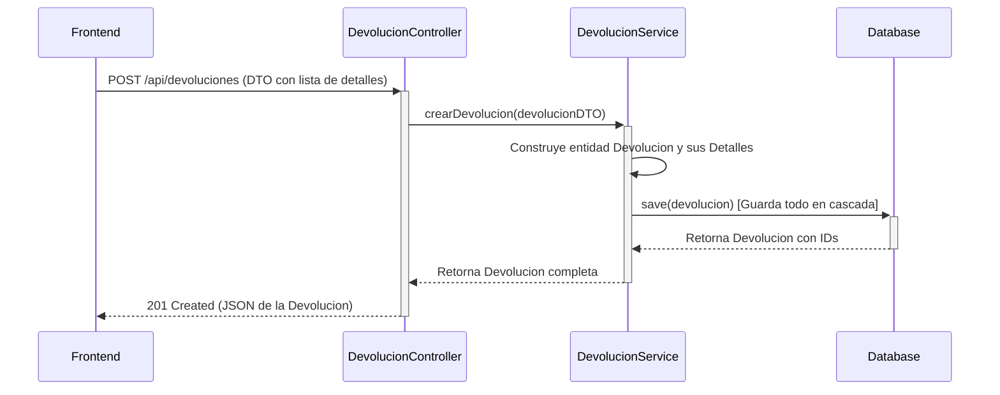
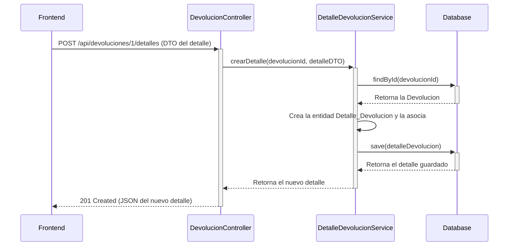
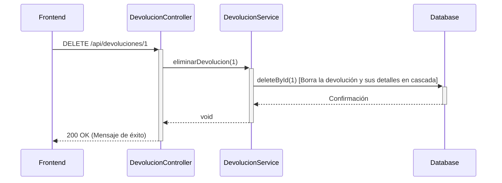
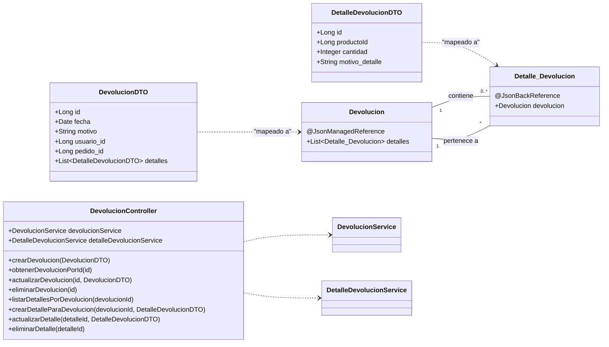

# Documentación del Módulo de Devoluciones (API Unificada)

Este documento detalla la arquitectura y lógica de negocio del módulo de devoluciones, contextualizado en un ejemplo de una carpintería para mayor claridad.

---

## 1. Contexto de Negocio: Carpintería "El Buen Mueble"

Imaginemos que "El Buen Mueble" vende muebles online. Un cliente realiza un pedido de varios productos (una mesa, cuatro sillas). Al recibir el pedido, una de las sillas tiene una pata rota.

*   **Devolución**: El cliente inicia un proceso de devolución para el pedido completo.
*   **Detalle de Devolución**: Dentro de esa devolución, especifica el producto a devolver: `1 x Silla de Roble`.
*   **Motivo**: "Producto dañado durante el transporte".

El objetivo de nuestra API es gestionar este proceso de forma eficiente y centralizada.

---

## 2. Arquitectura de la API: Controlador Unificado

Para simplificar la lógica y facilitar la integración con el frontend, se unificaron `DevolucionController` y `DetalleDevolucionController` en un solo **`DevolucionController`**. 

Este controlador ahora gestiona tanto las devoluciones como sus detalles, tratando a los detalles como un **sub-recurso** de una devolución. Esto sigue las mejores prácticas de diseño RESTful.

**Resumen de Endpoints:**

| Verbo   | Ruta                                    | Descripción                                         |
|---------|-----------------------------------------|-----------------------------------------------------|
| `POST`  | `/api/devoluciones`                     | Crea una nueva devolución con sus detalles.         |
| `GET`   | `/api/devoluciones`                     | Obtiene una lista de todas las devoluciones.        |
| `GET`   | `/api/devoluciones/{id}`                | Obtiene una devolución específica por su ID.        |
| `PUT`   | `/api/devoluciones/{id}`                | Actualiza una devolución existente.                 |
| `DELETE`| `/api/devoluciones/{id}`                | Elimina una devolución y todos sus detalles.        |
| `GET`   | `/api/devoluciones/{devolucionId}/detalles` | Lista los detalles de una devolución específica.    |
| `POST`  | `/api/devoluciones/{devolucionId}/detalles` | Añade un nuevo detalle a una devolución existente.  |
| `PUT`   | `/api/devoluciones/detalles/{detalleId}`  | Actualiza un detalle de devolución específico.      |
| `DELETE`| `/api/devoluciones/detalles/{detalleId}`  | Elimina un detalle de devolución específico.        |
| `GET`   | `/api/devoluciones/usuario/{usuarioId}`   | Busca todas las devoluciones de un usuario.         |
| `GET`   | `/api/devoluciones/pedido/{pedidoId}`     | Busca todas las devoluciones de un pedido.          |
| `POST`  | `/api/devoluciones/{id}/procesar`       | Marca una devolución como procesada.                |

---

## 3. Flujos de Operaciones

### 3.1. Crear una Devolución Completa

Un cliente reporta una silla rota y una mesa del color incorrecto en el mismo envío.

**Endpoint:** `POST /api/devoluciones`

**Lógica:**
1.  El frontend envía un `DevolucionDTO` que contiene los datos generales (ID de usuario, ID de pedido) y una lista de `DetalleDevolucionDTO` (uno por la silla, otro por la mesa).
2.  `DevolucionController` recibe la solicitud.
3.  `DevolucionService` crea la entidad `Devolucion` y, en un bucle, crea cada `Detalle_Devolucion`, asociándolo con su `Producto` y con la `Devolucion` padre.
4.  Gracias a `CascadeType.ALL`, al guardar la `Devolucion`, todos sus detalles se guardan en la misma transacción.

**Diagrama de Secuencia:**

### 3.2. Añadir un Detalle a una Devolución Existente

El cliente ya había reportado la silla rota, pero ahora se da cuenta de que los tornillos para la mesa no venían en el paquete.

**Endpoint:** `POST /api/devoluciones/{devolucionId}/detalles`

**Lógica:**
1.  El frontend envía un `DetalleDevolucionDTO` para los tornillos al endpoint específico de la devolución ya creada.
2.  `DevolucionController` pasa la solicitud al `DetalleDevolucionService`.
3.  El servicio busca la `Devolucion` existente, crea el nuevo `Detalle_Devolucion` y lo asocia.
4.  Se guarda el nuevo detalle.

**Diagrama de Secuencia:**

### 3.3. Eliminar una Devolución Completa

El cliente se arrepiente y decide quedarse con los productos, cancelando toda la devolución.

**Endpoint:** `DELETE /api/devoluciones/{id}`

**Lógica:**
1.  El frontend envía una solicitud para eliminar la devolución con ID `1`.
2.  `DevolucionController` llama a `devolucionService.eliminarDevolucion(id)`.
3.  El servicio invoca a `devolucionRepository.deleteById(id)`.
4.  Gracias a la configuración `CascadeType.ALL` y `orphanRemoval=true` en la entidad `Devolucion`, la base de datos se encarga de **eliminar automáticamente todos los registros de `Detalle_Devolucion` asociados** a esta devolución. Esto mantiene la integridad de los datos sin necesidad de lógica adicional en el servicio.

**Diagrama de Secuencia:**

---

## 4. Estructura de Datos y Serialización

### DTO vs. Entidad

*   **Entidades (`@Entity`)**: Modelan la base de datos (`Devolucion`, `Detalle_Devolucion`).
*   **DTOs (`DevolucionDTO`, `DetalleDevolucionDTO`)**: Modelan los datos para la API, simplificando la comunicación.

### Gestión de Ciclos de Serialización

Para evitar bucles infinitos al convertir las entidades a JSON, se usan las anotaciones de Jackson:
*   En `Devolucion`, la lista de detalles tiene `@JsonManagedReference`. Esto le dice a Jackson: "serializa esta lista".
*   En `Detalle_Devolucion`, la referencia a `Devolucion` tiene `@JsonBackReference`. Esto le dice: "no serialices este campo para evitar un ciclo".

### Diagrama de Clases (Actualizado)

