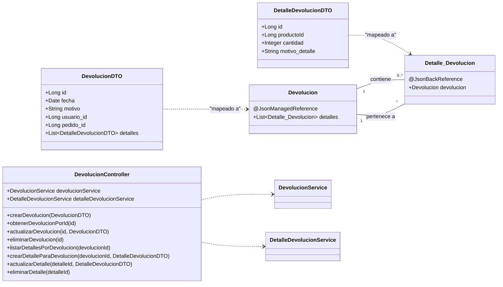

# Documentación del Módulo de Devoluciones (API Unificada)

Este documento detalla la arquitectura y lógica de negocio del módulo de devoluciones, contextualizado en un ejemplo de una carpintería para mayor claridad.

---

## 1. Contexto de Negocio: Carpintería "El Buen Mueble"

Imaginemos que "El Buen Mueble" vende muebles online. Un cliente realiza un pedido de varios productos (una mesa, cuatro sillas). Al recibir el pedido, una de las sillas tiene una pata rota.

*   **Devolución**: El cliente inicia un proceso de devolución para el pedido completo.
*   **Detalle de Devolución**: Dentro de esa devolución, especifica el producto a devolver: `1 x Silla de Roble`.
*   **Motivo**: "Producto dañado durante el transporte".

El objetivo de nuestra API es gestionar este proceso de forma eficiente y centralizada.

---

## 2. Arquitectura de la API: Controlador Unificado

Para simplificar la lógica y facilitar la integración con el frontend, se unificaron `DevolucionController` y `DetalleDevolucionController` en un solo **`DevolucionController`**. 

Este controlador ahora gestiona tanto las devoluciones como sus detalles, tratando a los detalles como un **sub-recurso** de una devolución. Esto sigue las mejores prácticas de diseño RESTful.

**Resumen de Endpoints:**

| Verbo   | Ruta                                    | Descripción                                         |
|---------|-----------------------------------------|-----------------------------------------------------|
| `POST`  | `/api/devoluciones`                     | Crea una nueva devolución con sus detalles.         |
| `GET`   | `/api/devoluciones`                     | Obtiene una lista de todas las devoluciones.        |
| `GET`   | `/api/devoluciones/{id}`                | Obtiene una devolución específica por su ID.        |
| `PUT`   | `/api/devoluciones/{id}`                | Actualiza una devolución existente.                 |
| `DELETE`| `/api/devoluciones/{id}`                | Elimina una devolución y todos sus detalles.        |
| `GET`   | `/api/devoluciones/{devolucionId}/detalles` | Lista los detalles de una devolución específica.    |
| `POST`  | `/api/devoluciones/{devolucionId}/detalles` | Añade un nuevo detalle a una devolución existente.  |
| `PUT`   | `/api/devoluciones/detalles/{detalleId}`  | Actualiza un detalle de devolución específico.      |
| `DELETE`| `/api/devoluciones/detalles/{detalleId}`  | Elimina un detalle de devolución específico.        |
| `GET`   | `/api/devoluciones/usuario/{usuarioId}`   | Busca todas las devoluciones de un usuario.         |
| `GET`   | `/api/devoluciones/pedido/{pedidoId}`     | Busca todas las devoluciones de un pedido.          |
| `POST`  | `/api/devoluciones/{id}/procesar`       | Marca una devolución como procesada.                |

---

## 3. Flujos de Operaciones con Ejemplos JSON

### 3.1. Crear una Devolución Completa

**Contexto:** Un cliente de "El Buen Mueble" recibe su pedido y encuentra una silla con una pata rota y una mesa del color equivocado. Decide devolver ambos artículos en un solo proceso.

**Endpoint:** `POST /api/devoluciones`

**Ejemplo de Petición (Request Body):**
```json
{
    "usuario_id": 1,
    "pedido_id": 101,
    "motivo": "Productos dañados en el envío y uno incorrecto.",
    "detalles": [
        {
            "productoId": 12,
            "cantidad": 1,
            "motivo_detalle": "La pata de la silla está rota."
        },
        {
            "productoId": 5,
            "cantidad": 1,
            "motivo_detalle": "La mesa es de color nogal, se pidió en roble."
        }
    ]
}
```

**Ejemplo de Respuesta (`201 Created`):**
```json
{
    "statusCode": 201,
    "message": "Devolución creada exitosamente",
    "data": {
        "id": 1,
        "fecha": "2025-06-19T20:15:00.000+00:00",
        "motivo": "Productos dañados en el envío y uno incorrecto.",
        "estado": "PENDIENTE",
        "detalles": [
            {
                "id": 1,
                "cantidad": 1,
                "motivo": "La pata de la silla está rota."
            },
            {
                "id": 2,
                "cantidad": 1,
                "motivo": "La mesa es de color nogal, se pidió en roble."
            }
        ]
    }
}
```

### 3.2. Obtener una Devolución por ID

**Contexto:** Un empleado de atención al cliente necesita revisar los detalles de la devolución anterior para coordinar el reemplazo de los productos.

**Endpoint:** `GET /api/devoluciones/1`

**Ejemplo de Respuesta (`200 OK`):**
```json
{
    "statusCode": 200,
    "message": "Devolución encontrada",
    "data": {
        "id": 1,
        "fecha": "2025-06-19T20:15:00.000+00:00",
        "motivo": "Productos dañados en el envío y uno incorrecto.",
        "estado": "PENDIENTE",
        "detalles": [
            {
                "id": 1,
                "cantidad": 1,
                "motivo": "La pata de la silla está rota."
            },
            {
                "id": 2,
                "cantidad": 1,
                "motivo": "La mesa es de color nogal, se pidió en roble."
            }
        ]
    }
}
```

### 3.3. Añadir un Detalle a una Devolución Existente

**Contexto:** El cliente, después de crear la devolución, se da cuenta de que también faltaban los tornillos para ensamblar la mesa.

**Endpoint:** `POST /api/devoluciones/1/detalles`

**Ejemplo de Petición (Request Body):**
```json
{
    "productoId": 25, 
    "cantidad": 1,
    "motivo_detalle": "Faltan los tornillos para el ensamblaje de la mesa."
}
```

**Ejemplo de Respuesta (`201 Created`):**
```json
{
    "statusCode": 201,
    "message": "Detalle añadido a la devolución 1",
    "data": {
        "id": 3,
        "cantidad": 1,
        "motivo": "Faltan los tornillos para el ensamblaje de la mesa."
    }
}
```

### 3.4. Eliminar una Devolución Completa

**Contexto:** La carpintería contacta al cliente y le ofrece un gran descuento para que se quede con la mesa de color nogal. El cliente acepta y decide cancelar toda la devolución.

**Endpoint:** `DELETE /api/devoluciones/1`

**Ejemplo de Respuesta (`200 OK`):**
```json
{
    "statusCode": 200,
    "message": "Devolución eliminada exitosamente"
}
```

---

## 4. Estructura de Datos y Serialización

### DTO vs. Entidad

*   **Entidades (`@Entity`)**: Modelan la base de datos (`Devolucion`, `Detalle_Devolucion`).
*   **DTOs (`DevolucionDTO`, `DetalleDevolucionDTO`)**: Modelan los datos para la API, simplificando la comunicación.

### Gestión de Ciclos de Serialización

Para evitar bucles infinitos al convertir las entidades a JSON, se usan las anotaciones de Jackson:
*   En `Devolucion`, la lista de detalles tiene `@JsonManagedReference`. Esto le dice a Jackson: "serializa esta lista".
*   En `Detalle_Devolucion`, la referencia a `Devolucion` tiene `@JsonBackReference`. Esto le dice: "no serialices este campo para evitar un ciclo".

### Diagrama de Clases (Actualizado)

